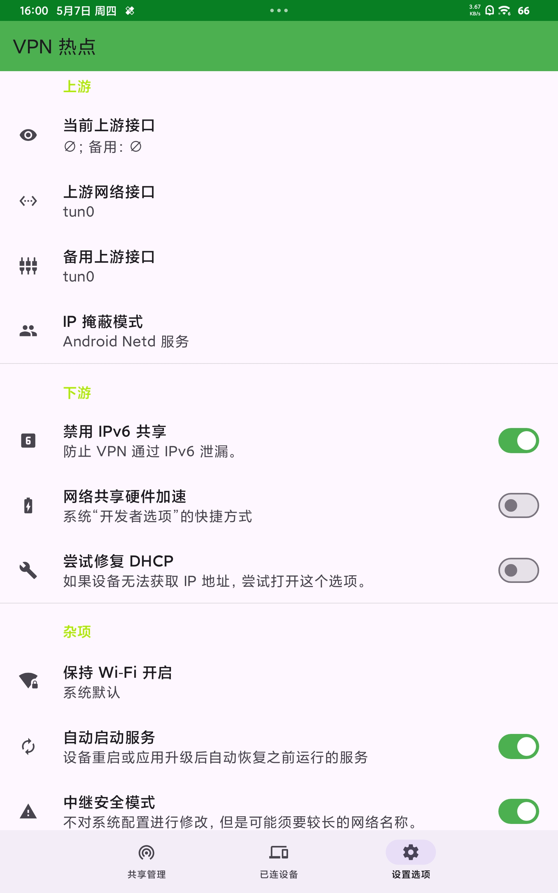
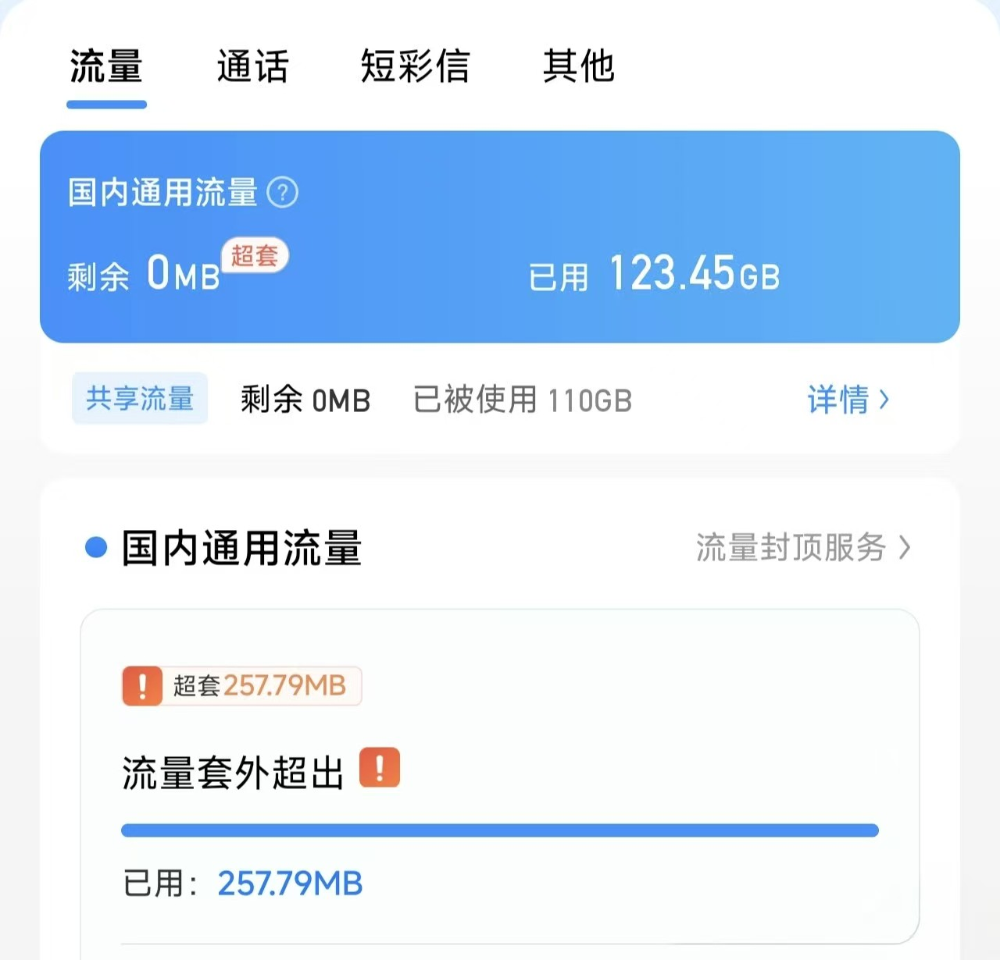

###  使用场景
某些通信厂商限制了热点，这时候我们就可以通过这种方式来让绕过
###  如何配置呢
#### 开始准备
**必须**   
一个随便VPN软件，[VPNHotspot](https://github.com/Mygod/VPNHotspot)，  

**可选**  
[termux](https://github.com/termux/termux-app)    
#### 开始配置
1.  配置vpn    
 gemini推荐我vpn用nekobox（我之前用的是v2rayNG来着，但是我没感觉到明显的区别），   
 （nekobox配置如下，没有就是我又鸽了，:spoiler[ ~~nekobox里面甚至可以配置上vless+realitly，实现手机连上共享网络直接科学上网，我写的是一个根本不通的配置~~]！ 但是我没整） 
 没问题，用表格呈现确实更加直观，方便你日后随时查阅核对。
以下是为你整理的 **HyperOS 免 Root 校园网热点防封终极配置表**：

 表 1：NekoBox 核心参数配置 (设置 菜单)

| 设置模块       | 配置项                 | 推荐设定         | 核心原理解析                             |
| :--------- | :------------------ | :----------- | :--------------------------------- |
| **入站设置**   | 允许来自局域网的连接          | **开启**       | 必开项，接管热点设备流量的“大门”，关闭会导致手机无网。       |
| **路由设置**   | IPv6 路由             | **关闭**       | 阻断针对 IPv6 特征及跳数 (Hop Limit) 的检测路径。 |
| **路由设置**   | 绕过局域网地址             | **开启**       | 确保能正常访问 10.x.x.x 等内网               |
| **DNS 设置** | 直连 DNS / 远程 DNS     | **填入 local** | 强制调用安卓系统分配的局域网 DNS，防止DNS泄漏。    |
| **DNS 设置** | 启用 DNS 路由 / FakeDNS | **关闭**       | 维持流量最原始的本地特征，防止产生虚假 IP 引起网关风控。     |

表 2：NekoBox 路由与分流规则 (路由 菜单)

| 规则类型     | 规则名称                | 状态设定        | 核心原理解析                        |
| -------- | ------------------- | ----------- | ----------------------------- |
| **路由规则** | 中国域名规则 (geosite:cn) | **开启 (绕过)** | 确保国内流量直连发出，只利用隧道洗掉 TTL=63 特征。 |
| **路由规则** | 中国IP规则 (geoip:cn)   | **开启 (绕过)** | 同上，降低日常上网延迟且完全不消耗你的流量。        |

2. vpn热点里面配置频段5G频段，IP 遮掩模式设置为Android Netd Service，然后打开设置选项，设置如图    
    
然后就是保活了，最起码两个软件的通知都要开一开，然后让你的其他设备测试一下
#### 进行检验
> [!QUESTION] 怎么验证 TTL 已经在内部“洗”成功了？
> 你要验证的是：数据包从物理网卡（wlan0）发出去时，TTL 是不是 64。  
找出你的物理出站网卡，通常是 wlan0。如果不确定，在终端输入 `ip route`，看 default 路由走的是哪个接口。

这是我的  
```powershell title="PowerShell 终端示例"
$ su
# ip route
10.111.0.0/16 dev wlan0 proto kernel scope link src 10.111.251.123
172.19.0.0/30 dev tun0 proto kernel scope link src 172.19.0.1
192.168.49.0/24 dev p2p0 proto kernel scope link src 192.168.49.1
```

可以看到，我有三个，一个p2p0（vpn热点）一个tun0（vpn）一个wlan0（正常网卡）  
然后打开[termux](https://github.com/termux/termux-app)（赋予root权限），看看wlan0的数据流正常不正常   
```powershell title="termux"
pkg install root-repo -y
pkg update -y
pkg install tcpdump -y
su
tcpdump -i wlan0 -v -n "src 内网ip and tcp"
```

这时候那你已经连上热点的手机刷几个视频，就可以看到大量的链接了，只要基本ttl都是64就算成功了

（就是充当路由器的设备可能会有点耗电（不过也没多耗电，我开了半个钟头，平板就没了一两格电））

### 下面是我的捣鼓经历
#### 这篇博客产生的缘由
因为苦于WIFI的限制两个设备且不让开热点（根本原因还是因为我发现100GB根本不够我一个设备用）
 
所以我们只能使用一些神秘手段进行修改了，
#### 第一次 openvpn+自己的服务器
首先，当然想的是不用登陆直接使用校园网了   
但是如果设备是一台"未认证"设备，却跑了已认证设备级别的流量。这个矛盾写在 DHCP 协议层，无法用任何技术手段消除，所以我直接不考虑了。~~（主要是怕社会工程学的攻击）~~  
（不过原理是服务器udp和443端口不会封来着，然后靠各种加密来伪造正常流量）  
#### 第二次 设备root + vpn热点
但是校园网会定期监测ttl，这个方法不够成熟，会被检测到  
#### 第三次 设备root +vpn热点 +[tether_unblock](https://github.com/evdenis/tether_unblock/issues)
我询问ttl问题，gemini告诉我直接刷一个magisk模块就好，他给我推荐了这个模块，但是到后面ttl还是没有更改，这是为什么呢  
```powershell title="Termux"
$ su
# /system/bin/iptables -t mangle -F POSTROUTING
# /system/bin/iptables -t mangle -I POSTROUTING -o wlan0 -j TTL --ttl-set 64
Warning: Extension TTL revision 0 not supported, missing kernel module?
iptables: No chain/target/match by that name.
```

> [!NOTE] 这行报错 Warning: Extension TTL revision 0 not supported, missing kernel module? 是整个问题的最核心原因，为什么会这样？
>    在编译 HyperOS（或较新的 Android 内核）时，为了精简系统或者安全考虑，把内核里的 xt_HL 和 xt_ttl 模块直接阉割了！  
>        

>[!QUESTION]  这也就是为什么刷了那个Magisk 模块却没用？    
>因为模块底层的 iptables --ttl-inc 1 命令在执行时，也是报了这个错，直接静默失败了，平板在物理层面上就丧失了修改转发数据包 TTL 的能力。在缺少内核模块的情况下，单纯靠改平板的 iptables 这条路已经彻底被堵死了。   
  
所以既然改不了，那就用成熟的vpn技术接管流量好了，也就是下一步   
#### 第四步 目前在用 root+vpn+vpn热点  
就是目前我在用的，最上面的那种方法，感谢您看到这里，谢谢

