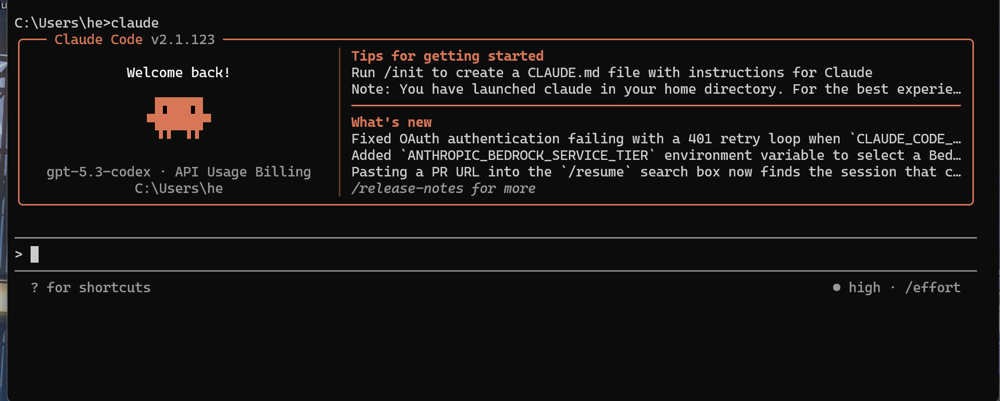
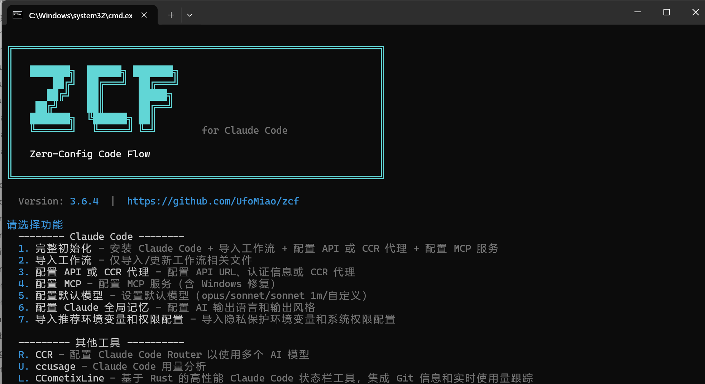

## 我的AI之旅

#### 刚接触AI
要说到我是什么时候接触AI的，那肯定还是25年刚开始的时候，那时候Deepseek也是真的火啊，然后之后我也尝试了豆包，只能说那时候的AI也仅仅是能用的程度（那时候还没接触国外的AI）
#### 然后是高考完了
在高考完了以后，似乎我还是沉迷国内AI ~~（尤其是deepseek，梁还是把我养的太好了）~~ ，与其说是只用国内AI，不如说是那时候根本不需要国外的AI，那时候我对AI的需求仅仅只是能检索就行
#### 事情转变在12月（也就是这个网站建立的时间）
然后在各种各样的情况下，我开始了解AI，然后开始使用了Gemini（感谢谷歌送的1年会员）和ChatGPT，然后真的感觉到了AI的好用之初，但是几乎每个刚接触AI的人都会有的一段时间我也有了，过于相信AI，被AI幻觉误扰了，详情见[卸载显卡驱动的几件事](https://blog.nairain.com/posts/downgrade-graphics-driver/)，当时明明有更好的方式，但我还是选择了AI，~~有AI依赖了说是~~。
#### 3月之后
我开始购买服务器，自建CPA，然后在各种AI中辗转反侧的故事了，那时候研究各种 :spoiler[ OpenAI注册机 ]！   真的有点魔了，基本天天就在各种捣鼓了，然后也玩了opus4.6（我的课表就是opus搓的）

## 一些好用的工具

#### Claude Code
AI-Agent用起来挺舒服的，让当时只接触了ai ide的我大为震惊

#### CC SWITCH
1. 能给claude code/其他平台 接入自己的api（终于不用被官方API的高额账单背刺了）
2. 很方便就能统一管理，一键切换
#### ZCF
能给Claude code 加人设 ~~（你cluade，变猫娘）~~
