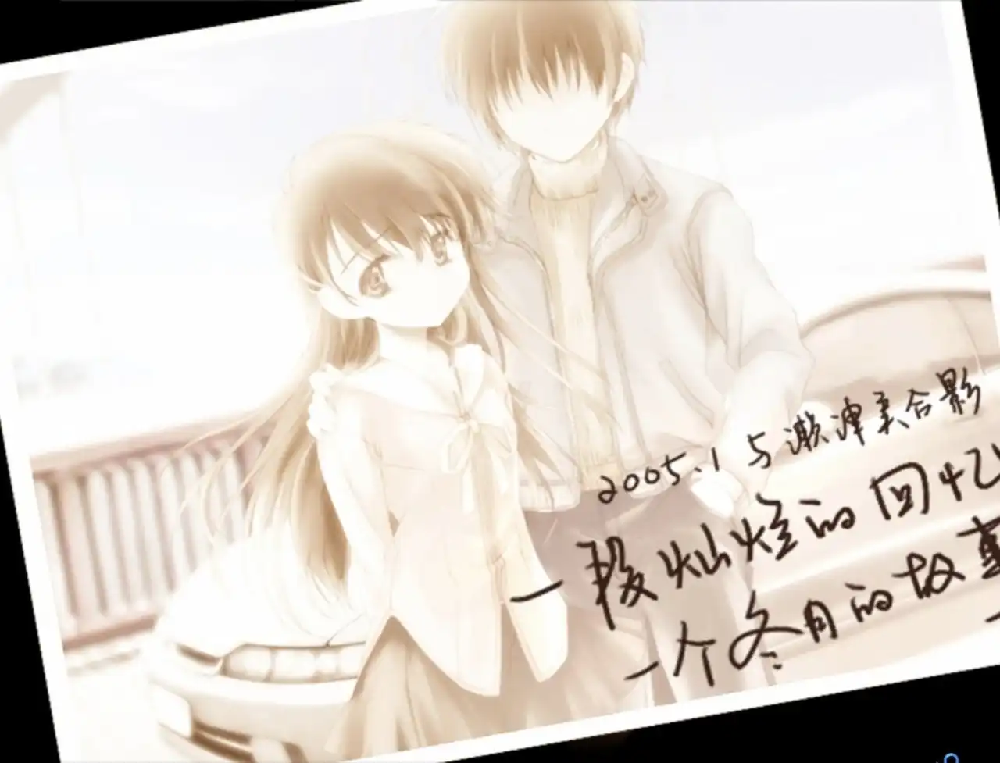
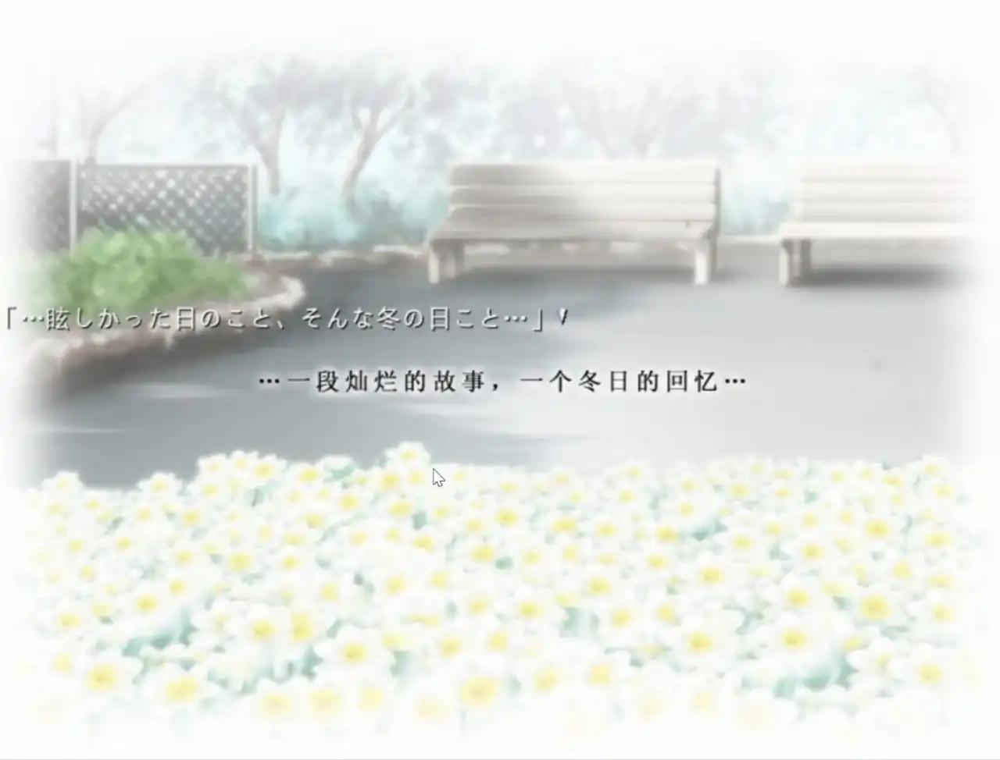
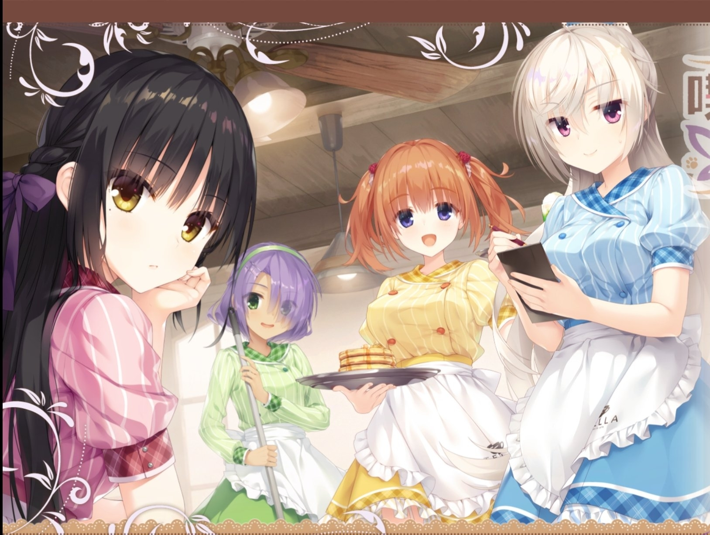

# 2026.03
####  这篇文章的写作目的
为什么我要写这篇文章呢，主要是我为了不要让我的博客过于杂乱，每一篇gal都要写一篇文章的话，不仅让网站看起来杂乱，而且读起来体验感也不太好，而且每一部Gal我都不会写很多 ~~（写太多感觉就成简介了）~~ ，所以我就做了这个决定，把他们合并了好了，之前的也合并了，日期保持从现在到之前的顺序，建站前的就先不写了。

# 2026.01
## 《Narcissus》- 一段灿烂的故事，一个冬日的回忆

推完了水仙1和水仙2，在推的时候哭了好几次，眼泪不自觉的就流了出来。水仙真的是我第一部这样的游戏，而且音乐也是极好的，水仙还是太超模了。
水仙虽然是零几年的作品，但是真的值得玩一玩。  
虽然只是两个故事，但是很容易让人深思。最让我难以忘怀的是水仙1里面的  
-你会…拉住我吗  
-你…希望我拉住你吗  

我也在思考这个问题，如果真的有一天，我到了这种境界，我会怎么做呢，最终只能得到那个答案「不知道」，对于我来说，果然还是以后的事，以后在说吧。  
而且在水仙2里面对于姬子的话也是照应了津美子的问题了，姬子也问过同样的问题。  
里面的**尼洛和阿洛伊斯**（姬子）的故事和终章那个**7F的传承**也让我挺感动的。 让我在缓两天吧，可能还会在去推水仙3，但是果然还是先让我缓几天吧  
**记于2026.1.20**

## 《星光咖啡馆与死神之蝶》
推了两个星期，终于推完了，之前听别人说这个游戏剧情很困，所以一直没有去推，但是我自己推起来之后感觉还好，夏目的线确实很温馨，和普通大学生生活一样，不过感觉里面还是有点吊桥效应的因素存在的，栞那的线就真的是魔幻性十足了，不过看前面栞那和御地的对话，我还以为男主设定是身份比较特殊呢，后面才发现原来是这样（先不剧透了），剧情也是很好的，感觉在废萌作算剧情可以的了

不过话说真的有人能在身边都是女孩子的店里面干下去吗，我感觉我真的做不到，怎么想也做不到的吧
下一部，就推水仙1和2了
**记于2026.1.03**
# 2025.12
## 《永不枯萎的世界与终结之花》的一些感悟
这个GAL其实我很早前就想推了，但是我的拖延症发力了，所以直到今天才正式的推完（中间断了有快两年了，明明这个作品也不长的），因为那时候还在上高中的原因，所以断断续续的。

说真的，最开始想推这个游戏，是因为[鲲的《爱莲说》](https://www.kungal.com/doc/ren)来着，加上莲真的很好看 :spoiler[ ~~（我真的不是llk）~~] 但是推完以后才感觉到主角真的有好好在拯救这个世界，明明自己已经千疮百孔了，还能把莲救下来，看到主角最后把莲的翅膀也拿走的时候，我真的哭了，宁愿自己消失，也不愿意让自己的家人受伤，主角真的有好好在践行自己的愿望。即便其他家人们已经失去了关于他的记忆了，他也会因为和家人的约定，重新回到家乡，去完成自己的使命。不过好在结局是好的，这部gal总体来说是很好的，包括节奏什么的，值得一试。

推完以后感觉心有点痛，就写了这些，就这样吧。
**记于2025.12.21 2时**  